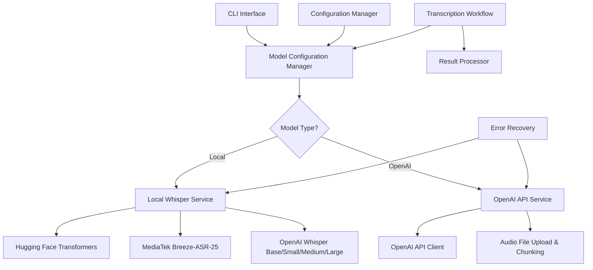
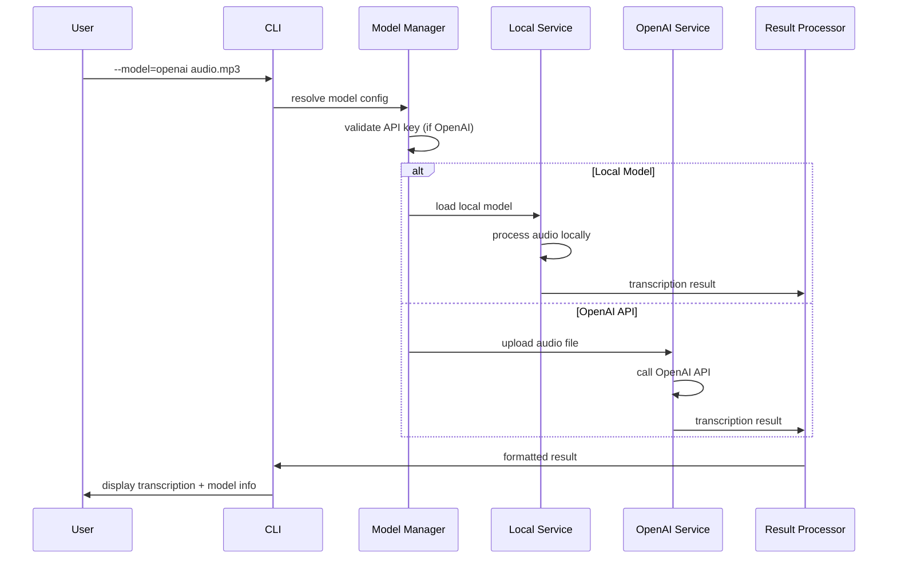
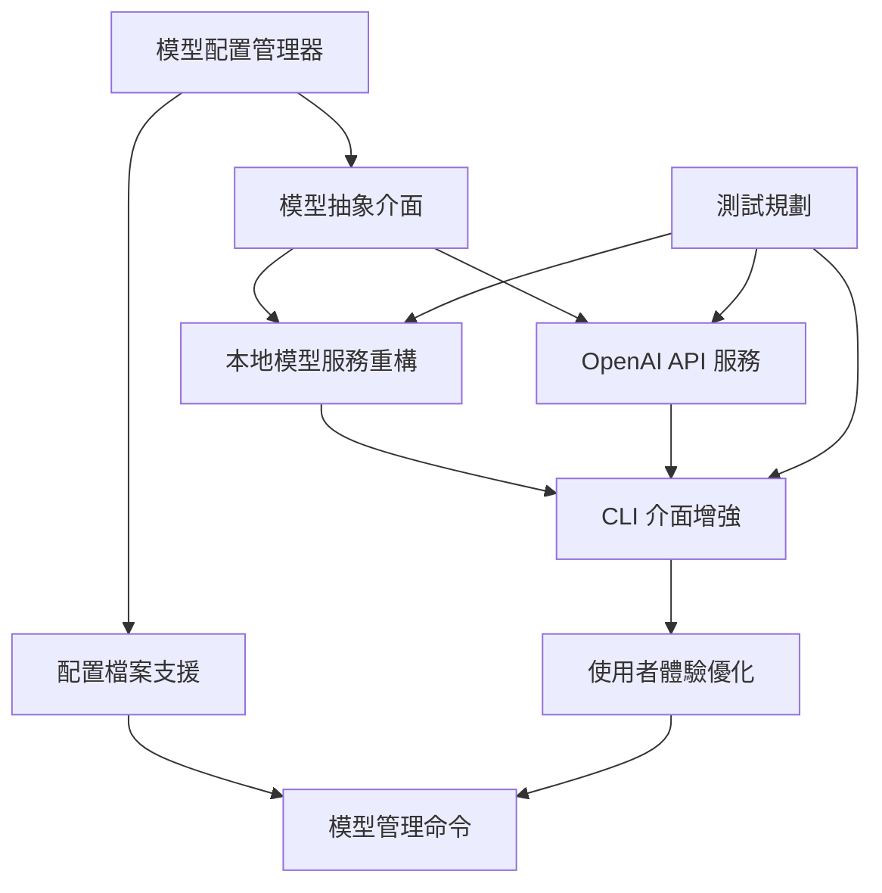

# PRD: 多模型選擇系統 - 支援本地與 OpenAI Whisper

PRD 對應 Issue: [scrible-wise-003](https://github.com/user/scrible-wise/issues/3)
> 請於實作開始時將此 Issue 狀態設為 "In Progress"，完成後設為 "Done" 並附上 PRD 連結。

## 功能概述

擴展現有的 Scrible Wise 音訊轉錄工具，支援多種 Whisper 模型選擇，包括本地模型（現有 Breeze-ASR-25、OpenAI Whisper 系列）和 OpenAI API 服務，讓使用者可以根據需求、預算和效能要求選擇最適合的語音識別引擎。

## 技術架構圖



## 模型選擇流程圖



## 技術任務 Checklist

### Phase 1: 模型配置系統 🏗️
- [ ] **建立模型配置管理器**
    - 建立 `ModelConfig` 類別於 `config/model_config.py`
    - 實作 `ModelType` enum (LOCAL_BREEZE, LOCAL_WHISPER_BASE, LOCAL_WHISPER_SMALL, LOCAL_WHISPER_MEDIUM, LOCAL_WHISPER_LARGE, OPENAI_API)
    - 實作 `ModelSettings` dataclass 包含模型參數配置
    - 支援環境變數配置: `WHISPER_MODEL_TYPE`, `OPENAI_API_KEY`, `WHISPER_MODEL_PATH`
    - 實作配置檔案支援 (`models.yaml`)
    - 新增模型元數據管理 (名稱、版本、語言支援、記憶體需求)
    - 技術細節: 使用 `pydantic>=2.0` 進行配置驗證，支援動態模型切換

- [ ] **建立模型抽象介面**
    - 建立 `BaseTranscriptionService` 抽象類別於 `services/base.py`
    - 定義統一的 `transcribe(audio_path: str) -> TranscriptionResult` 介面
    - 實作 `ModelMetadata` 類別包含模型資訊（名稱、版本、語言支援、效能指標）
    - 支援非同步轉錄: `async def transcribe_async(audio_path: str) -> TranscriptionResult`
    - 實作模型載入狀態管理和生命週期控制
    - 新增統一的錯誤處理介面
    - 技術細節: 使用 ABC (Abstract Base Class)，支援 context manager 模式

### Phase 2: 本地模型服務重構 🔧
- [ ] **重構現有本地模型架構**
    - 建立 `LocalBreezeService` 於 `services/local_breeze.py`
    - 從現有 `transcription/workflow.py` 抽取 Breeze-ASR-25 邏輯
    - 實作模型快取機制避免重複載入相同模型
    - 支援 GPU/CPU/MPS 自動選擇和效能優化
    - 新增記憶體使用監控和優化
    - 技術細節: 保持向後相容，使用現有 `transformers>=4.53.3`

- [ ] **新增 OpenAI Whisper 本地模型支援**
    - 安裝 `openai-whisper>=20231117` 套件
    - 建立 `LocalWhisperService` 於 `services/local_whisper.py`
    - 支援模型大小選擇: base, small, medium, large, large-v2, large-v3
    - 實作模型下載和快取管理
    - 支援多語言轉錄（中文、英文、其他語言）
    - 新增模型量化選項 (fp16, int8) 降低記憶體使用
    - 技術細節: 使用官方 `whisper` 套件，支援 CUDA/MPS 加速

- [ ] **本地模型參數配置**
    - 實作 `LocalModelParams` 配置類別
    - 支援可配置參數: temperature, beam_size, best_of, patience
    - 實作語言自動偵測和手動指定
    - 新增音訊前處理選項 (降噪、音量正規化)
    - 支援批次處理配置和並行處理
    - 技術細節: 參數驗證使用 `pydantic`，設備偵測整合現有邏輯

### Phase 3: OpenAI API 服務整合 ☁️
- [ ] **OpenAI API 客戶端實作**
    - 安裝 `openai>=1.3.0` 套件
    - 建立 `OpenAITranscriptionService` 於 `services/openai_service.py`
    - 實作 API 金鑰驗證和安全管理
    - 支援音訊檔案上傳和分片處理 (25MB 檔案大小限制)
    - 實作 API 速率限制處理和佇列管理
    - 新增費用追蹤和預算控制功能
    - 技術細節: 使用官方 `openai` Python SDK，支援非同步上傳和進度追蹤

- [ ] **OpenAI API 錯誤處理與恢復**
    - 建立 `OpenAIError` 例外類別繼承自 `TranscriptionError`
    - 實作 API 限制處理 (quota exceeded, rate limits, invalid API key)
    - 支援自動重試機制 (指數退避，最大 3 次重試)
    - 實作網路錯誤恢復策略和連線重建
    - 新增 API 用量監控和成本警告
    - 技術細節: 整合現有 `error_recovery` 系統，支援可配置重試參數

### Phase 4: CLI 介面增強 🖥️
- [ ] **CLI 模型選擇參數**
    - 新增 `--model` 參數支援模型選擇
        - `--model local-breeze` (預設，向後相容)
        - `--model local-whisper-base|small|medium|large`
        - `--model openai`
    - 實作 `--list-models` 顯示可用模型清單和狀態
    - 新增 `--model-params` 支援模型參數覆寫
    - 支援配置檔案指定: `--config models.yaml`
    - 實作模型自動偵測和效能建議
    - 技術細節: 擴展現有 `cli/main.py`，參數驗證使用 `argparse`

- [ ] **使用者體驗優化**
    - 實作模型下載進度顯示 (本地模型首次使用)
    - 新增 API 用量和預估費用顯示 (OpenAI)
    - 支援模型效能比較和建議輸出
    - 實作模型載入狀態和進度指示
    - 新增詳細的錯誤訊息和恢復建議
    - 顯示轉錄結果來源模型資訊
    - 技術細節: 使用 `rich>=13.0` 套件提供進度條和美化輸出

### Phase 5: 配置與管理系統 ⚙️
- [ ] **配置檔案支援**
    - 建立 `models.yaml` 範本檔案和文件
    - 實作配置檔案驗證和載入機制
    - 支援多環境配置 (development, production)
    - 新增配置遷移和版本管理
    - 實作敏感資料加密存儲 (API keys)
    - 支援配置繼承和覆寫機制
    - 技術細節: 使用 `PyYAML>=6.0`，支援 JSON Schema 驗證

- [ ] **模型管理命令**
    - 實作 `--setup-models` 初始化模型配置精靈
    - 新增 `--download-model <name>` 預下載本地模型
    - 支援 `--validate-config` 驗證配置檔案
    - 實作 `--benchmark-models` 效能和準確度測試
    - 新增 `--cleanup-models` 清理未使用模型
    - 支援 `--model-info <name>` 顯示模型詳細資訊
    - 技術細節: 擴展 CLI 介面，支援子命令架構

### Phase 6: 測試與品質保證 🧪
- [ ] **單元測試規劃**
    - 測試 `ModelConfig` 配置管理邏輯
    - 測試各模型服務類別的統一介面
    - 測試錯誤處理和恢復機制
    - Mock OpenAI API 進行離線測試
    - 測試配置檔案載入和驗證
    - 技術細節: 使用 pytest + pytest-asyncio + responses

- [ ] **整合測試規劃**
    - 端到端模型切換測試
    - OpenAI API 整合測試 (需要測試 API key)
    - CLI 介面完整功能測試
    - 配置檔案和環境變數整合測試
    - 效能和記憶體使用測試
    - 技術細節: 建立測試音訊檔案，支援 CI/CD 環境

## 技術依賴關係



## 技術規格摘要

### 新增依賴
- `openai>=1.3.0` - OpenAI API 客戶端
- `openai-whisper>=20231117` - OpenAI Whisper 本地模型
- `PyYAML>=6.0` - YAML 配置檔案支援
- `rich>=13.0.0` - 終端機輸出美化和進度條
- `pydantic>=2.0` - 配置驗證和資料模型

### 支援的模型

**本地模型 (免費，需要本地運算資源):**
- MediaTek Breeze-ASR-25 (現有，中文優化)
- OpenAI Whisper Base (~39MB, 最快)
- OpenAI Whisper Small (~244MB, 平衡)
- OpenAI Whisper Medium (~769MB, 較好準確度)
- OpenAI Whisper Large (~1550MB, 最佳準確度)

**雲端服務 (付費，無需本地資源):**
- OpenAI Whisper API (whisper-1 模型)

### 使用範例

```bash
# 使用預設模型 (Breeze-ASR-25)
uv run python -m cli.main audio.mp3

# 使用本地 Whisper 模型
uv run python -m cli.main --model local-whisper-small audio.mp3

# 使用 OpenAI API
uv run python -m cli.main --model openai audio.mp3

# 列出可用模型
uv run python -m cli.main --list-models

# 下載本地模型
uv run python -m cli.main --download-model local-whisper-medium

# 使用配置檔案
uv run python -m cli.main --config my-models.yaml audio.mp3
```

### 配置檔案範例

```yaml
# models.yaml
default_model: "local-breeze"

models:
  local-breeze:
    type: "local"
    model_name: "MediaTek-Research/Breeze-ASR-25"
    device: "auto"  # auto, cpu, mps, cuda
    chunk_length: 30

  local-whisper-small:
    type: "local"
    model_name: "openai/whisper-small"
    device: "auto"
    language: "zh"  # auto, zh, en
    temperature: 0.0

  openai:
    type: "api"
    api_key_env: "OPENAI_API_KEY"
    model: "whisper-1"
    response_format: "text"
```

### 效能比較預估

| 模型 | 檔案大小 | 記憶體使用 | 速度 | 準確度 | 成本 |
|------|----------|------------|------|--------|------|
| Breeze-ASR-25 | ~1.5GB | ~2GB | 1x | 高(中文) | 免費 |
| Whisper Base | ~39MB | ~1GB | 2x | 中 | 免費 |
| Whisper Small | ~244MB | ~2GB | 1.5x | 中高 | 免費 |
| Whisper Medium | ~769MB | ~4GB | 1x | 高 | 免費 |
| Whisper Large | ~1.5GB | ~8GB | 0.8x | 最高 | 免費 |
| OpenAI API | 0MB | ~100MB | 網路延遲 | 最高 | $0.006/分鐘 |

### 向後相容性

- 保持現有 CLI 介面完全不變（預設使用 Breeze-ASR-25）
- 現有的 `python main.py` 繼續正常工作
- 新功能通過可選參數提供
- 配置檔案完全可選，預設使用現有行為
- 所有現有測試繼續通過

### 安全性考量

- API 金鑰僅透過環境變數或加密配置檔案提供
- 本地模型快取位置可配置
- 上傳到 OpenAI 的音訊檔案自動清理
- 支援代理伺服器配置
- API 用量監控和預算限制

## 實作進度總結

### 🔄 下一步驟
- **Phase 1**: 建立模型配置系統和抽象介面
- **建議方向**: 優先實作本地模型支援，再擴展到 OpenAI API

**測試審查與交付規範**
- Phase 1-2 完成後須驗證所有本地模型通過統一介面測試
- Phase 3 完成後需要有效的 OpenAI API 金鑰進行整合測試
- Phase 4-5 完成後須確保 CLI 使用者體驗測試通過
- 最終交付前需要完整的效能基準測試和向後相容性驗證
