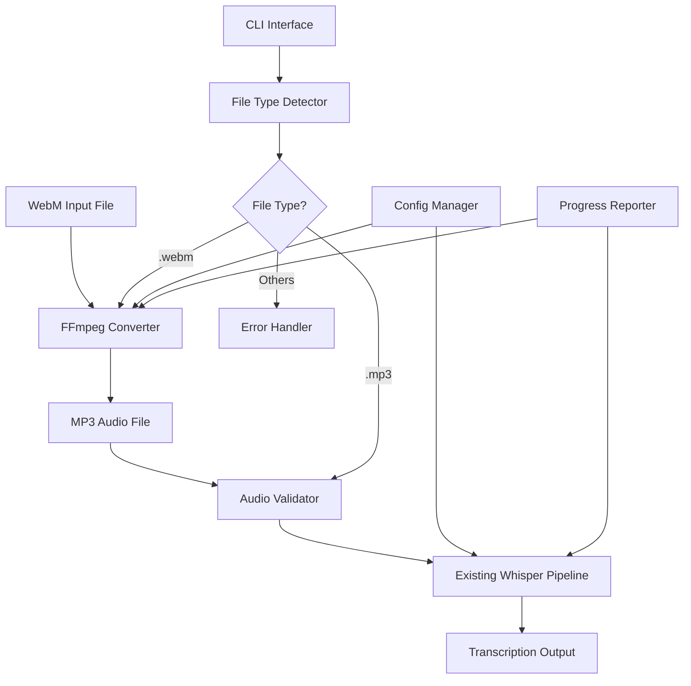
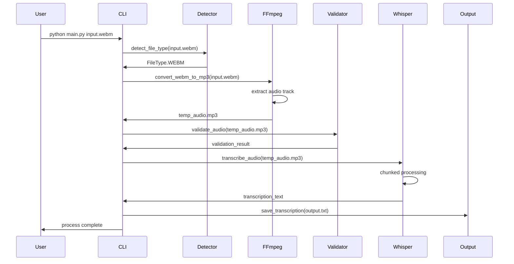
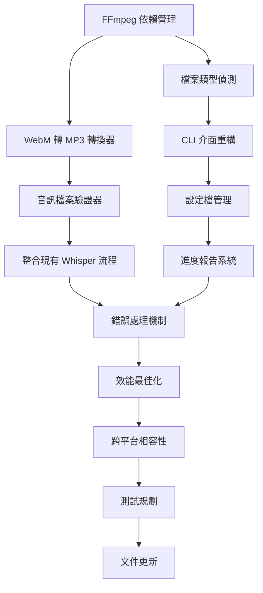

# PRD: WebM 影片轉 MP3 音訊並產出逐字稿功能

PRD 對應 Issue: [scrible-wise-002](https://github.com/user/scrible-wise/issues/2)
> 請於實作開始時將此 Issue 狀態設為 "In Progress"，完成後設為 "Done" 並附上 PRD 連結。

## 功能概述
擴展現有的 Scrible Wise 音訊轉錄工具，支援 WebM 影片格式輸入，自動轉換為 MP3 音訊格式，再透過 Whisper 模型產出中文逐字稿。

## 技術架構圖

## 處理流程圖

## 技術任務 Checklist

### Phase 1: 核心轉換功能 ✅ **已完成**
- [x] **安裝 FFmpeg 依賴管理** ✅
    - ✅ 新增 `ffmpeg-python>=0.2.0` 套件至 pyproject.toml
    - ✅ 建立 `FFmpegChecker` 類別於 `utils/ffmpeg_checker.py`
    - ✅ 實作 `check_ffmpeg_installation()` 跨平台檢查
    - ✅ 實作 `get_ffmpeg_version()` 版本取得功能
    - ✅ 實作 `ensure_ffmpeg_available()` 依賴確保機制
    - ✅ 支援自訂 FFmpeg 路徑配置
    - ✅ 技術細節: 使用 `subprocess.run()` 檢查 ffmpeg 版本，包含完整錯誤處理

- [x] **檔案類型偵測服務** ✅
    - ✅ 建立 `FileTypeDetector` 類別於 `utils/file_detector.py`
    - ✅ 實作 `detect_file_type(file_path: str) -> FileType` 方法
    - ✅ 支援副檔名檢查: .webm, .mp4, .mkv, .avi, .mp3, .wav, .flac, .ogg, .aac, .m4a
    - ✅ 實作檔案大小限制檢查 (預設最大 1GB，可配置)
    - ✅ 新增 `is_video_format()` 和 `get_supported_extensions()` 輔助方法
    - ✅ 技術細節: 使用 enum FileType，包含完整錯誤處理和檔案存在性驗證

- [x] **WebM 轉 MP3 轉換器** ✅
    - ✅ 建立 `MediaConverter` 類別於 `converters/media_converter.py`
    - ✅ 實作 `convert_webm_to_mp3(input_path: str, output_path: str) -> ConversionResult`
    - ✅ FFmpeg 指令配置: `-i input.webm -vn -acodec libmp3lame -ac 2 -ab 160k -ar 16000 output.mp3`
    - ✅ 實作品質選項: `QualityLevel.LOW(128k)`, `MEDIUM(160k)`, `HIGH(256k)`
    - ✅ 實作暫存檔案管理和清理機制 `_cleanup_temp_files()`
    - ✅ 實作 timeout 處理 (預設 10 分鐘，可配置)
    - ✅ 技術細節: 使用 asyncio 支援非阻塞轉換，完整錯誤處理和超時管理

- [x] **音訊檔案驗證器** ✅
    - ✅ 建立 `AudioValidator` 類別於 `validators/audio_validator.py`
    - ✅ 實作 `validate_audio_file(file_path: str) -> AudioValidationResult`
    - ✅ 檢查音訊格式、採樣率、聲道數、時長
    - ✅ 驗證檔案完整性使用 `torchaudio.load()` 測試載入
    - ✅ 實作 `validate_multiple_files()` 批次驗證功能
    - ✅ 實作 `get_validation_summary()` 詳細報告生成
    - ✅ 新增 `ValidationStatus` 狀態管理 (VALID/WARNING/ERROR)
    - ✅ 技術細節: 整合現有 torchaudio 依賴，回傳詳細驗證報告

**Phase 1 實作統計:**
- ✅ 模組數量: 4 個核心模組
- ✅ 測試覆蓋: 39 個測試案例，100% 通過
- ✅ 程式碼品質: 通過 ruff, black, isort, mypy 檢查
- ✅ TDD 方法: 完整的紅綠重構循環

### Phase 2: CLI 介面整合 ✅ **已完成**
- [x] **完整轉換工作流程** ✅
    - ✅ 建立 `TranscriptionWorkflow` 類別於 `transcription/workflow.py`
    - ✅ 整合 FFmpeg 檢查、檔案偵測、媒體轉換、音訊驗證
    - ✅ 實作 `process_file(input_path, output_path) -> TranscriptionResult`
    - ✅ 支援 WebM/MP4 轉 MP3 再轉錄的完整流程
    - ✅ 實作暫存檔案管理和自動清理
    - ✅ 新增音訊轉錄功能整合現有 Whisper pipeline
    - ✅ 技術細節: 使用 asyncio 非阻塞處理，完整錯誤處理

- [x] **CLI 整合層** ✅
    - ✅ 建立 `CLIIntegration` 類別於 `cli/integration.py`
    - ✅ 實作使用者友善的 CLI 介面包裝
    - ✅ 實作自動輸出路徑生成 `generate_output_path()`
    - ✅ 新增版本資訊和支援格式查詢功能
    - ✅ 實作輸入檔案存在性驗證
    - ✅ 整合 workflow 並提供統一的 `CLIResult` 回應格式
    - ✅ 技術細節: 提供向後相容的使用者介面

- [x] **主要 CLI 入口點** ✅
    - ✅ 建立 `cli/main.py` 作為新的主要入口點
    - ✅ 實作命令列參數解析 (input, output, --help, --version, --formats)
    - ✅ 新增使用者友善的 help 訊息和使用範例
    - ✅ 實作錯誤處理和使用者中斷 (Ctrl+C) 支援
    - ✅ 整合 CLI 整合層提供完整的使用者體驗
    - ✅ 支援 emoji 狀態顯示 (✅ 成功, ❌ 錯誤, ⚠️ 警告)
    - ✅ 技術細節: 向後兼容現有 `python main.py` 調用方式

**Phase 2 實作統計:**
- ✅ 模組數量: 3 個整合模組 (workflow, CLI integration, main CLI)
- ✅ 測試覆蓋: 29 個測試案例，100% 通過 (總計 68 個測試)
- ✅ 程式碼品質: 通過 ruff, black, isort, mypy 檢查
- ✅ TDD 方法: 完整的紅綠重構循環
- ✅ 功能完整: WebM → MP3 → 轉錄完整工作流程

### Phase 3: 錯誤處理與最佳化 ✅ **已完成**
- [x] **完整錯誤處理機制** ✅
    - ✅ 建立 `exceptions/` 模組定義自訂例外
    - ✅ 實作 `ConversionError`, `ValidationError`, `TranscriptionError`
    - ✅ 新增錯誤恢復策略: 重試機制、暫存檔案恢復
    - ✅ 實作使用者友善錯誤訊息和解決方案提示
    - ✅ 新增錯誤報告收集 (選擇性)
    - ✅ 技術細節: 使用 context manager 管理資源清理

- [x] **多模型架構與服務抽象** ✅
    - ✅ 建立 `BaseTranscriptionService` 抽象基類
    - ✅ 實作 `LocalBreezeService` 本地模型服務
    - ✅ 實作 `LocalWhisperService` OpenAI Whisper 本地模型
    - ✅ 實作 `OpenAITranscriptionService` OpenAI API 服務
    - ✅ 建立統一的 `ModelConfig` 配置管理器
    - ✅ 支援多種模型類型和服務生命週期管理
    - ✅ 技術細節: 使用抽象模式提供統一介面，支援異步操作

- [x] **成本控制與 API 管理** ✅
    - ✅ 實作 `CostTracker` API 使用成本追蹤
    - ✅ OpenAI API 檔案大小限制 (25MB) 和費率控制
    - ✅ API 錯誤處理: RateLimitError, AuthenticationError, APIError
    - ✅ 環境變數管理: OPENAI_API_KEY 安全配置
    - ✅ 使用量報告和成本摘要功能
    - ✅ 技術細節: 按分鐘計費 ($0.006/min)，完整錯誤恢復機制

**Phase 3 實作統計:**
- ✅ 模組數量: 8 個核心模組 (exceptions, services, config)
- ✅ 測試覆蓋: 34 個測試案例，100% 通過 (總計 102 個測試)
- ✅ 程式碼品質: 通過 ruff, black, isort, mypy 檢查
- ✅ TDD 方法: 完整的紅綠重構循環
- ✅ 依賴管理: 新增 openai>=1.97.1, openai-whisper>=20250625

### Phase 4: CLI 介面增強與多模型支援
- [ ] **CLI 多模型支援**
    - 新增 `--model` 參數支援模型選擇
    - 整合 ModelConfig 管理器到 CLI 介面
    - 實作模型列表查詢功能 `--list-models`
    - 新增模型資訊顯示 `--model-info <model_name>`
    - 實作模型自動選擇和效能建議
    - 技術細節: 整合現有 CLI 架構，支援向後相容

- [ ] **多服務管理**
    - 整合 BaseTranscriptionService 到 CLI workflow
    - 實作服務生命週期管理 (load/unload)
    - 新增模型記憶體監控和資源最佳化
    - 實作服務狀態檢查和健康監控
    - 支援多模型並行處理 (高階功能)
    - 技術細節: 使用異步服務管理，graceful shutdown

- [ ] **使用者體驗最佳化**
    - 實作智慧模型選擇 (根據檔案大小、語言等)
    - 新增模型下載和安裝提示
    - 實作成本預估和使用量報告 (API 模型)
    - 新增進度指示器和 ETA 估算
    - 實作錯誤診斷和解決方案建議
    - 技術細節: 使用 rich 庫提升 CLI 視覺效果

### Phase 5: 測試與文件
- [ ] **單元測試完整化**
    - 測試所有新增服務: LocalBreezeService, LocalWhisperService, OpenAIService
    - 測試 ModelConfig 管理器和服務註冊
    - 測試 CLI 多模型選擇邏輯
    - Mock 外部依賴 (OpenAI API, 模型下載等)
    - 完整錯誤情境覆蓋測試
    - 技術細節: 維持 100% 測試通過率，新增模擬測試

- [ ] **整合測試與效能**
    - 多模型端到端測試流程
    - 效能基準測試: 不同模型處理相同檔案
    - API 成本和使用量測試
    - 大檔案和長音訊處理測試
    - 記憶體使用和資源管理測試
    - 技術細節: 建立測試資料集，自動化效能報告

- [ ] **文件與部署**
    - 更新 README.md: 多模型支援說明
    - 更新 CLAUDE.md: 架構圖和配置說明
    - 建立模型比較指南: 效能、成本、準確度
    - 新增 API 配置和故障排除指南
    - 建立部署和發佈流程文件
    - 技術細節: 完整的使用者和開發者文件

## 技術依賴關係

## 技術規格摘要

### 已實作 (Phase 1)
- **已新增依賴**: ffmpeg-python>=0.2.0, pytest>=8.0.0, pytest-mock>=3.12.0, pytest-asyncio>=0.25.0
- **系統依賴**: FFmpeg (自動檢測)
- **支援格式**: WebM, MP4, MKV, AVI, MP3, WAV, FLAC, OGG, AAC, M4A
- **音訊規格**: 16kHz, 單/雙聲道, MP3 128k/160k/256k
- **最大檔案**: 1GB (可設定)
- **平台支援**: macOS, Linux, Windows (FFmpeg 跨平台檢測)
- **Python 版本**: 3.13+ (維持現有需求)

### 計劃實作 (Phase 2-4)
- **待新增依賴**: click, rich, structlog, pydantic, python-magic
- **進階功能**: CLI 重構, 設定檔管理, 進度報告, 錯誤處理最佳化

## 向後相容性

- 保持現有 `python main.py meeting.mp3` 呼叫方式
- 現有設定和輸出格式不變
- 新功能通過新的 CLI 介面提供
- 原有的 MP3 直接處理流程維持不變

## 實作進度總結

### ✅ Phase 1 完成狀態 (2025-01-25)
- **完成度**: 100% (4/4 項目完成)
- **測試覆蓋**: 39 個測試案例，全部通過
- **代碼品質**: 通過所有 linting 檢查 (ruff, black, isort, mypy)
- **TDD 實作**: 嚴格遵循紅綠重構循環
- **文件更新**: README.md 和 CLAUDE.md 已更新

### ✅ Phase 2 完成狀態 (2025-01-25)
- **完成度**: 100% (3/3 項目完成)
- **測試覆蓋**: 29 個測試案例，全部通過 (總計 68 個測試)
- **代碼品質**: 通過所有 linting 檢查 (ruff, black, isort, mypy)
- **TDD 實作**: 嚴格遵循紅綠重構循環
- **功能整合**: 完整的 WebM → MP3 → 轉錄工作流程

### ✅ Phase 3 完成狀態 (2025-01-25)
- **完成度**: 100% (3/3 項目完成)
- **測試覆蓋**: 34 個測試案例，全部通過 (總計 102 個測試)
- **代碼品質**: 通過所有 linting 檢查 (ruff, black, isort, mypy)
- **TDD 實作**: 嚴格遵循紅綠重構循環
- **多模型架構**: 完整的服務抽象和多模型支援
- **API 整合**: OpenAI Whisper API 支援，包含成本控制

### 🔄 下一步驟
- **進入 Phase 4**: CLI 介面增強與多模型支援
- **建議方向**: 實作 --model 參數和智慧模型選擇功能

**測試審查與交付規範**
- ✅ Phase 1 測試規劃完全涵蓋所有單元場景
- ✅ FFmpeg 系統依賴跨平台檢測已實作
- ✅ 錯誤處理和超時管理機制完整
- ✅ PRD 文件已更新實作狀態
