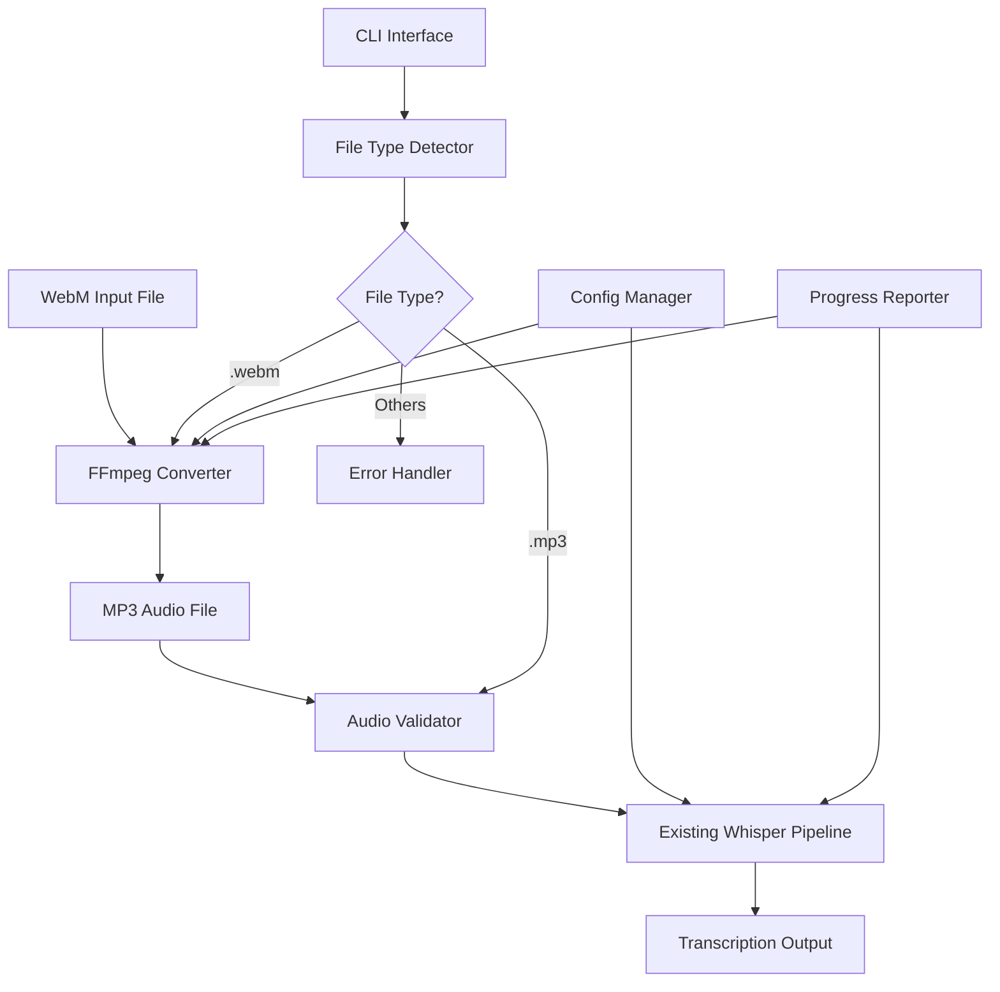
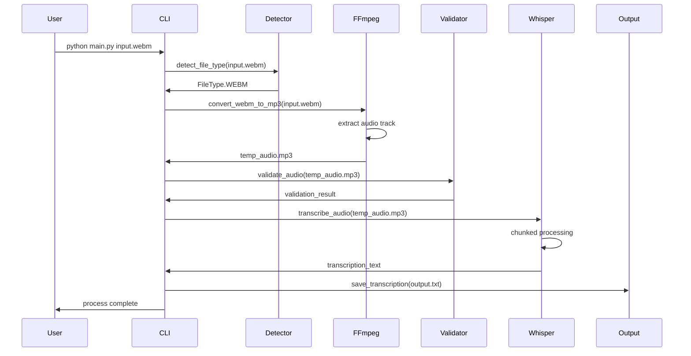
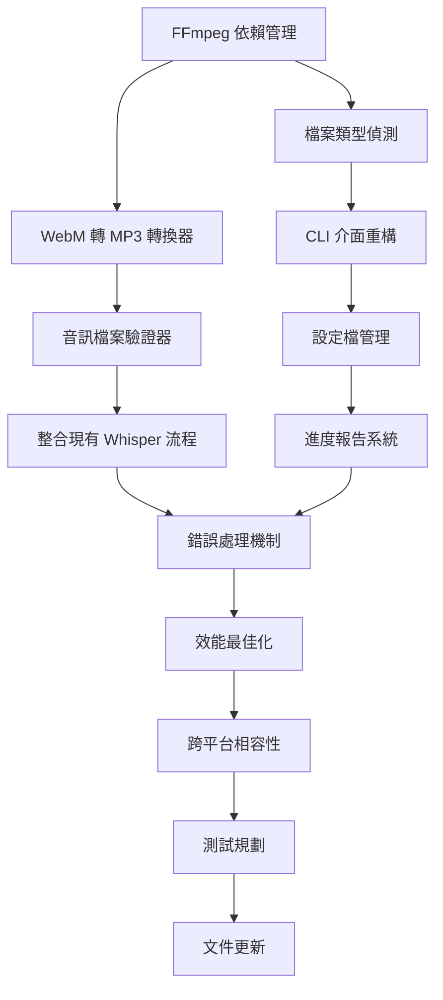

# PRD: WebM 影片轉 MP3 音訊並產出逐字稿功能

PRD 對應 Issue: [scrible-wise-002](https://github.com/user/scrible-wise/issues/2)
> 請於實作開始時將此 Issue 狀態設為 "In Progress"，完成後設為 "Done" 並附上 PRD 連結。

## 功能概述
擴展現有的 Scrible Wise 音訊轉錄工具，支援 WebM 影片格式輸入，自動轉換為 MP3 音訊格式，再透過 Whisper 模型產出中文逐字稿。

## 技術架構圖

## 處理流程圖

## 技術任務 Checklist

### Phase 1: 核心轉換功能
- [ ] **安裝 FFmpeg 依賴管理**
    - 新增 `python-ffmpeg` 或 `ffmpeg-python` 套件至 pyproject.toml
    - 建立 FFmpeg 系統依賴檢查函數 `check_ffmpeg_installation()`
    - 實作跨平台 FFmpeg 安裝指引 (macOS: brew, Linux: apt/yum, Windows: 手動)
    - 設定環境變數 `FFMPEG_PATH` 支援
    - 技術細節: 使用 `subprocess.run()` 檢查 ffmpeg 版本，要求 v4.0+

- [ ] **檔案類型偵測服務**
    - 建立 `FileTypeDetector` 類別於 `utils/file_detector.py`
    - 實作 `detect_file_type(file_path: str) -> FileType` 方法
    - 支援副檔名檢查: .webm, .mp4, .mkv, .avi, .mp3, .wav, .flac
    - 實作檔案 MIME type 驗證使用 `python-magic` 套件
    - 新增檔案大小限制檢查 (預設最大 1GB)
    - 技術細節: 使用 enum FileType，包含錯誤處理和檔案存在性驗證

- [ ] **WebM 轉 MP3 轉換器**
    - 建立 `MediaConverter` 類別於 `converters/media_converter.py`
    - 實作 `convert_webm_to_mp3(input_path: str, output_path: str) -> ConversionResult`
    - FFmpeg 指令配置: `-i input.webm -vn -acodec libmp3lame -ac 2 -ab 160k -ar 16000 output.mp3`
    - 實作轉換進度追蹤使用 FFmpeg progress parsing
    - 新增轉換品質選項: low(128k), medium(160k), high(256k)
    - 實作暫存檔案管理和清理機制
    - 技術細節: 使用 asyncio 支援非阻塞轉換，設定 timeout (預設 10 分鐘)

- [ ] **音訊檔案驗證器**
    - 建立 `AudioValidator` 類別於 `validators/audio_validator.py`
    - 實作 `validate_audio_file(file_path: str) -> ValidationResult`
    - 檢查音訊格式、採樣率、聲道數、時長
    - 驗證檔案完整性使用 `torchaudio.load()` 測試載入
    - 實作音訊品質分析: 檢測靜音片段、音量過低警告
    - 新增音訊元數據提取 (duration, bitrate, codec)
    - 技術細節: 整合現有 torchaudio 依賴，回傳詳細驗證報告

### Phase 2: CLI 介面增強
- [ ] **命令列介面重構**
    - 安裝 `click` 套件 (version ^8.1.0) 替換現有 CLI
    - 建立 `cli/main.py` 作為新的入口點
    - 實作 `transcribe` 指令: `python -m scrible_wise transcribe input.webm`
    - 新增命令選項: `--output`, `--quality`, `--keep-temp`, `--format`
    - 實作 `convert` 純轉換指令: `python -m scrible_wise convert input.webm output.mp3`
    - 新增 `--help` 和版本資訊顯示
    - 技術細節: 向後兼容現有 `python main.py` 調用方式

- [ ] **設定檔管理系統**
    - 建立 `config/settings.py` 設定管理模組
    - 支援 YAML 設定檔 `scrible-wise.yaml`
    - 可配置項目: FFmpeg路徑、輸出目錄、預設品質、Whisper模型
    - 實作環境變數覆蓋: `SCRIBLE_WISE_*` 前綴
    - 新增設定檔驗證和預設值機制
    - 技術細節: 使用 `pydantic` 進行設定驗證，支援 XDG 設定目錄

- [ ] **進度報告與日誌系統**
    - 建立 `utils/progress.py` 進度追蹤模組
    - 實作轉換進度條使用 `rich` 套件
    - 新增 structured logging 使用 `structlog`
    - 實作階段性進度報告: 檔案檢查 → 轉換 → 驗證 → 轉錄
    - 新增詳細錯誤訊息和恢復建議
    - 設定日誌等級和輸出格式控制
    - 技術細節: 整合 asyncio 支援，日誌檔案輪轉機制

### Phase 3: 錯誤處理與最佳化
- [ ] **完整錯誤處理機制**
    - 建立 `exceptions/` 模組定義自訂例外
    - 實作 `ConversionError`, `ValidationError`, `TranscriptionError`
    - 新增錯誤恢復策略: 重試機制、暫存檔案恢復
    - 實作使用者友善錯誤訊息和解決方案提示
    - 新增錯誤報告收集 (選擇性)
    - 技術細節: 使用 context manager 管理資源清理

- [ ] **效能最佳化**
    - 實作平行處理: 轉換與 Whisper 模型載入並行
    - 新增記憶體使用監控和最佳化
    - 實作轉換快取機制 (避免重複轉換相同檔案)
    - 新增暫存目錄管理和空間清理
    - 最佳化大檔案處理流程
    - 技術細節: 使用 asyncio + threading，設定記憶體限制參數

- [ ] **跨平台相容性**
    - 測試 macOS、Linux、Windows 平台支援
    - 實作平台特定的 FFmpeg 路徑偵測
    - 處理檔案路徑分隔符號差異
    - 新增 Docker 容器化支援 (Dockerfile)
    - 實作 CI/CD 多平台測試
    - 技術細節: 使用 pathlib 處理路徑，tox 多環境測試

### Phase 4: 測試與文件
- [ ] **單元測試規劃**
    - 測試 `FileTypeDetector`: 檔案類型偵測準確性
    - 測試 `MediaConverter`: 轉換功能、錯誤處理、進度追蹤
    - 測試 `AudioValidator`: 音訊驗證邏輯
    - 測試 CLI 介面: 命令參數解析、錯誤處理
    - Mock FFmpeg 依賴進行單元測試
    - 技術細節: 使用 pytest + pytest-mock，建立測試音訊檔案

- [ ] **整合測試規劃**
    - 端到端測試: WebM → MP3 → 逐字稿完整流程
    - 效能測試: 大檔案處理、記憶體使用
    - 平台測試: 多作業系統相容性驗證
    - 錯誤情境測試: 損壞檔案、磁碟空間不足、FFmpeg 缺失
    - 技術細節: 使用 GitHub Actions 多平台 CI/CD

- [ ] **文件更新**
    - 更新 README.md: 新增 WebM 支援說明
    - 更新 CLAUDE.md: 新增架構和依賴資訊
    - 建立使用指南: CLI 指令範例、設定檔說明
    - 新增故障排除文件: 常見錯誤和解決方案
    - 建立開發者文件: API 參考、擴展指南
    - 技術細節: 使用 MkDocs 建立完整文件網站

## 技術依賴關係

## 技術規格摘要

- **新增依賴**: ffmpeg-python, click, rich, structlog, pydantic, python-magic
- **系統依賴**: FFmpeg 4.0+
- **支援格式**: WebM, MP4, MKV, AVI → MP3, WAV
- **音訊規格**: 16kHz, 單/雙聲道, MP3 128-256kbps
- **最大檔案**: 1GB (可設定)
- **平台支援**: macOS, Linux, Windows
- **Python 版本**: 3.13+ (維持現有需求)

## 向後相容性

- 保持現有 `python main.py meeting.mp3` 呼叫方式
- 現有設定和輸出格式不變
- 新功能通過新的 CLI 介面提供
- 原有的 MP3 直接處理流程維持不變

**測試審查與交付規範**
- 請於 PRD checklist 全部勾選完成前，回顧測試規劃是否涵蓋所有單元與整合場景
- 特別注意 FFmpeg 系統依賴的跨平台測試
- 確保大檔案處理和記憶體使用的效能測試完整
- PRD 文件開頭必須標註對應 Issue 連結，並於實作開始與結束時同步更新 Issue 狀態
